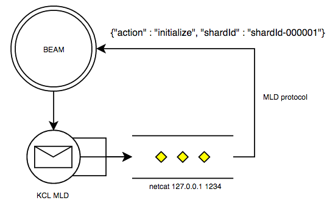

# erlmld

This application allows Kinesis and DynamoDB streams to be processed using Erlang (by way
of the KCL MultiLangDaemon).

## Erlang - MultiLangDaemon concept

The [Kinesis Client Library](https://github.com/awslabs/amazon-kinesis-client) abstracts
away the distribution of work among a group of workers which are processing data found on
a Kinesis stream, including lease management and the assignment of specific workers to
specific shards.

A component of the KCL is the MultiLangDaemon, which allows non-Java applications to be
more easily integrated with the KCL by way of a simple JSON protocol: it launches one
subprocess per owned shard and communicates on stdin/stdout.

AdRoll needed the ability to perform Kinesis data processing in an Erlang system, and thus
this project was born.  We launch one `erlmld` supervision tree per Kinesis/DynamoDB
stream being processed in an Erlang node.  This results in an instance of the
MultiLangDaemon being launched as a port program for each stream being processed.

Each MLD process in turn launches one subprocess for each owned shard; these are simply
netcat or socat processes which map I/O back to the Erlang node via TCP, allowing us to do
all data processing in Erlang:

A `gen_statem` worker implements the MLD protocol on the Erlang side; one of these runs in
a process for each shard owned by the current worker.

A [MultiLangDaemon
adapter](https://github.com/awslabs/dynamodb-streams-kinesis-adapter/blob/master/src/main/java/com/amazonaws/services/dynamodbv2/streamsadapter/StreamsMultiLangDaemon.java)
supports DynamoDB streams using the same MLD protocol.

AdRoll uses this to implement a high-performance global cache population system which
supports a real-time bidding platform also implemented in Erlang.
